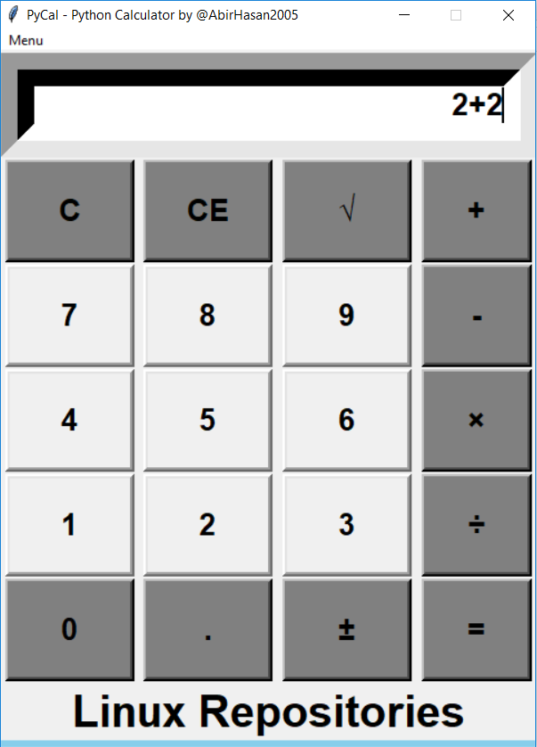
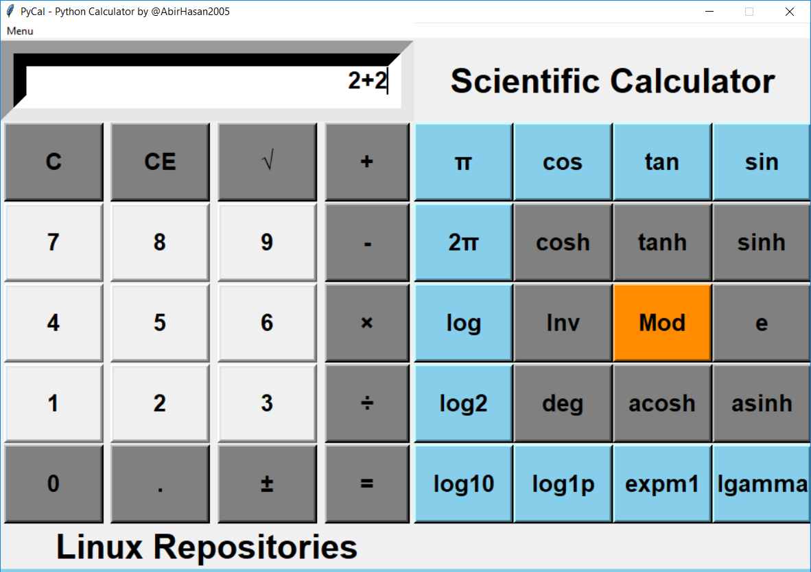

# PyCal v1.0
### This is a Python3 based GUI Calculator. Tkinter GUI package. By [@AbirHasan2005](https://facebook.com/AbirHasan2005).

## Screenshots:

## Made for:
   - Linux OS
   - Windows OS ***EXE FIle available in [Releases](https://github.com/AbirHasan2005/PyCal/releases)***
   - Mac OS

## Requirements:
   - Python v3
   - Tkinter Python Module (python3-tk), (tkinter)

### Join Telegram Group for any kind of help:

## Follow Me:

## Donate Me:

